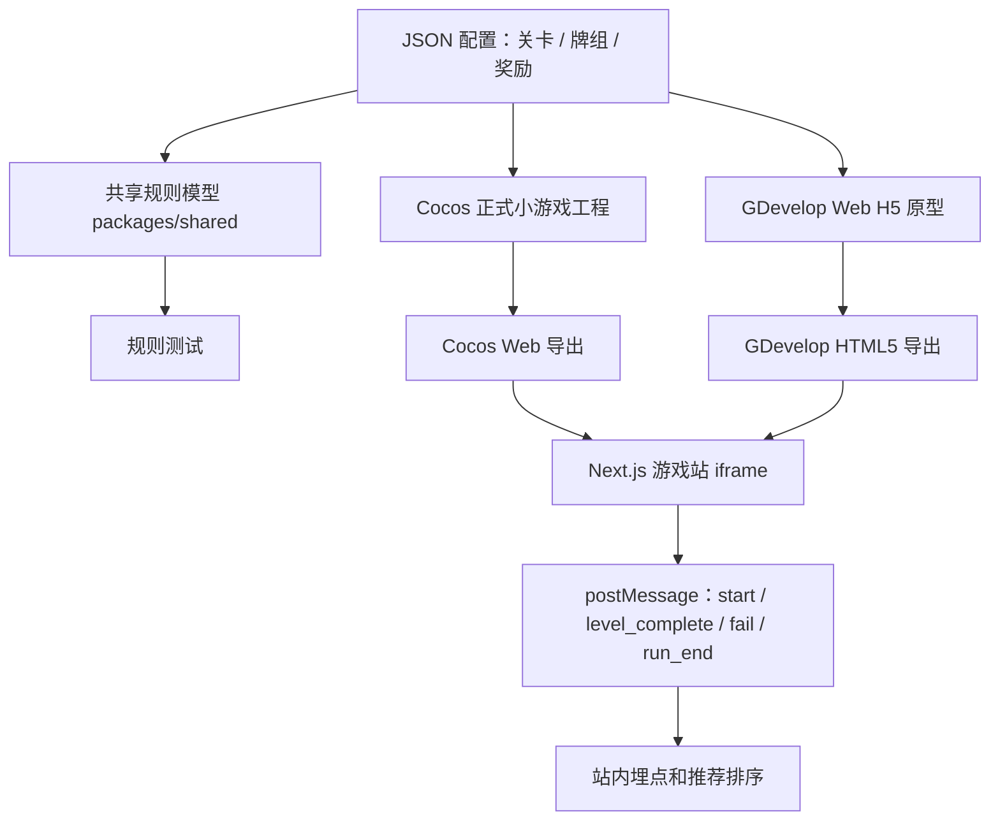

# 麻将 Roguelike 消除框架调研与规划

**日期**：2026-05-21  
**任务**：T029  
**状态**：讨论基线，不直接进入实现

## 1. 结论

推荐采用“双工程 + 共享配置”的路线：

- `packages/shared` 放核心规则模型：牌、花色、组合判断、奖励效果、关卡目标。
- `apps/game/mahjong-roguelike` 放正式 Cocos Creator 工程和配置。
- `apps/game/gdevelop/mahjong-roguelike-prototype` 可放 GDevelop Web H5 原型。
- `apps/web/src/modules/games/mahjong-roguelike` 后续只做站内嵌入壳、详情页数据适配、埋点和 iframe 通信。

原因：

- Cocos Creator 更适合正式小游戏发布路径，尤其后续微信小游戏和抖音小游戏。
- GDevelop 适合快速做 Web H5 原型，便于非工程人员调节关卡和事件逻辑。
- 游戏规则和关卡奖励如果先配置化，后续从 GDevelop 原型迁移到 Cocos 时不会推倒重来。
- Web 站点不应该承载核心游戏逻辑，否则正式小游戏工程会和站内试玩割裂。

## 2. 官方文档依据

- Cocos Creator 官方文档提供 Web Mobile / Web Desktop 发布目标，适合站内试玩导出。
- Cocos Creator 官方文档提供微信小游戏、字节小游戏等小游戏发布路径，符合正式发布主线。
- Cocos Creator 支持以资源形式加载 JSON 配置，可承载关卡、奖励和数值。
- GDevelop 官方文档支持导出 HTML5 到本地文件夹，适合放入站内 iframe 或静态目录验证。
- GDevelop 支持 JavaScript 事件和变量系统，但复杂规则仍建议沉到共享模型和配置。
- HTML iframe 和 `window.postMessage` 是站内嵌入游戏、回传开始/结束/得分事件的标准浏览器能力。

参考链接：

- [Cocos Creator 3.8 Manual](https://docs.cocos.com/creator/3.8/manual/en/)
- [Cocos Creator 发布 Web](https://docs.cocos.com/creator/3.8/manual/en/editor/publish/publish-web.html)
- [Cocos Creator 发布小游戏](https://docs.cocos.com/creator/3.8/manual/en/editor/publish/publish-mini-game.html)
- [Cocos Creator JSON 资源](https://docs.cocos.com/creator/3.0/manual/en/asset-workflow/json.html)
- [GDevelop HTML5 本地导出](https://wiki.gdevelop.io/gdevelop5/publishing/html5_game_in_a_local_folder/)
- [GDevelop 变量](https://wiki.gdevelop.io/gdevelop5/all-features/variables/)
- [MDN iframe](https://developer.mozilla.org/en-US/docs/Web/HTML/Reference/Elements/iframe)
- [MDN window.postMessage](https://developer.mozilla.org/en-US/docs/Web/API/Window/postMessage)

## 3. 目录规划

```text
docs/modules/mahjong-roguelike/
  README.md
  FRAMEWORK_PLAN.md
  IMPLEMENTATION_PLAN.md
  PROGRESS.md
  DECISIONS.md
  HANDOFF.md

packages/shared/src/
  mahjong-game.ts
  mahjong-game.test.ts

apps/game/mahjong-roguelike/
  README.md
  assets/
  config/
    levels.json
    relics.json
    tiles.json
  docs/
    rules.md
    publishing.md

apps/game/gdevelop/mahjong-roguelike-prototype/
  README.md
  export/
  source/

apps/web/src/modules/games/mahjong-roguelike/
  MahjongGameEmbed.tsx
  game-events.ts
  content.ts

apps/web/src/app/games/mahjong-roguelike/
  page.tsx
```

说明：

- `packages/shared` 是规则真相来源。
- `apps/game/mahjong-roguelike/config` 是 Cocos 和原型共同读取或转换的配置来源。
- GDevelop 原型允许存在，但不能成为唯一工程主线。
- `apps/web/src/app/**` 只挂载模块入口，不写游戏业务逻辑。

## 4. 核心架构



## 5. 游戏运行时分层

### 5.1 规则层

职责：

- 定义牌面：花色、点数、唯一 ID、层级、遮挡关系。
- 判断组合：`碰 / 吃 / 杠`。
- 应用奖励：槽位 +1、倍率变化、洗牌、返还步数等。
- 判断失败：槽位满且没有可消除组合。
- 判断过关：牌面清空或完成胡牌目标。

规则层优先用 TypeScript 写纯函数，并配测试。

### 5.2 配置层

职责：

- 关卡牌堆。
- 遮挡层。
- 初始槽位数。
- 目标组合。
- 可出现奖励池。
- 难度参数。

配置应保持引擎无关，不写 Cocos 节点名或 GDevelop 对象名。

### 5.3 表现层

职责：

- 牌的渲染、点击、动画、音效。
- 槽位移动动画。
- 消除反馈。
- 奖励选择 UI。
- 失败和通关界面。

Cocos 和 GDevelop 可以各自实现表现层，但都应读取同一套配置概念。

### 5.4 站点壳层

职责：

- 游戏详情页。
- iframe 容器。
- 移动端横竖屏提示。
- 接收游戏事件。
- 记录开始、关卡完成、失败、通关、停留时长。

站点壳层不直接判断麻将规则。

## 6. 配置草案

### 6.1 牌定义

```json
{
  "suits": ["wan", "tiao", "tong"],
  "ranks": [1, 2, 3, 4, 5, 6, 7, 8, 9]
}
```

### 6.2 关卡配置

```json
{
  "id": "level_001",
  "name": "第一把",
  "slotLimit": 7,
  "clearGoal": "clear_all",
  "huGoal": null,
  "tiles": [
    {
      "id": "l1_t001",
      "suit": "wan",
      "rank": 1,
      "layer": 0,
      "x": 120,
      "y": 180,
      "blockedBy": ["l1_t010"]
    }
  ],
  "rewardPool": ["slot_plus_1", "peng_refund_step", "chi_score_double"]
}
```

### 6.3 奖励配置

```json
{
  "id": "slot_plus_1",
  "name": "多留一手",
  "rarity": "common",
  "trigger": "passive",
  "effect": {
    "type": "slot_limit_delta",
    "value": 1
  }
}
```

## 7. 原型路线

### 阶段 A：纸面规则和配置

- 定义 9 种基础牌型：`万 / 条 / 筒` x `1-9`。
- 定义 5 个最小奖励。
- 定义 3 个测试关卡。
- 用共享测试证明组合判断有效。

验收：

- `碰 / 吃 / 杠 / 非法组合` 测试通过。
- 奖励可以修改槽位或倍率。

### 阶段 B：Web 原型

可选路线：

- GDevelop：快速验证点击、槽位、消除、奖励选择、失败反馈。
- 轻量 React/Canvas 原型：如果团队希望完全代码可控，也可以先做站内 Web 原型。

建议优先 GDevelop，但必须遵守：

- 关卡和奖励不写死在场景事件里。
- 导出 HTML5 后放入统一嵌入壳验证。
- 只验证手感和节奏，不承担正式发布。

### 阶段 C：Cocos 正式工程

- 建立 Cocos 项目。
- 读取 JSON 配置。
- 实现牌堆层级、点击、槽位、组合消除。
- 实现奖励选择和 run 状态。
- 导出 Web 版本给站内试玩。
- 准备微信/抖音小游戏发布文档。

### 阶段 D：站点接入

- 建游戏详情页。
- iframe 加载 Web 导出。
- 通过 `postMessage` 接收事件。
- 接入埋点。
- 游戏卡片、推荐和 AI 搜索索引指向详情页。

## 8. iframe 通信事件

游戏向站点发送：

```ts
type MahjongGameEvent =
  | { type: "game_ready"; version: string }
  | { type: "run_started"; runId: string }
  | { type: "level_started"; runId: string; levelId: string }
  | { type: "combo_cleared"; combo: "peng" | "chi" | "gang"; tileIds: string[] }
  | { type: "reward_selected"; rewardId: string }
  | { type: "level_completed"; runId: string; levelId: string; score: number }
  | { type: "run_failed"; runId: string; levelId: string; reason: "slot_full" }
  | { type: "run_completed"; runId: string; score: number };
```

站点向游戏发送：

```ts
type MahjongHostEvent =
  | { type: "host_ready" }
  | { type: "pause" }
  | { type: "resume" }
  | { type: "restart" };
```

安全要求：

- iframe 使用明确来源或同源静态路径。
- `postMessage` 接收侧校验 `origin` 和事件结构。
- 不通过消息传递用户敏感信息。

## 9. 玩法细节待讨论

这些问题建议在写 T017 代码前定稿：

1. 第一版到底偏“爽快消除”还是“策略构筑”？
2. 槽位默认是 7 个、8 个还是随关卡变化？
3. `吃` 是否允许跨槽位自动识别，还是需要玩家手动选择三张？
4. `杠` 是 4 张立即消除，还是留到奖励触发时消除？
5. `清一色` 是局内倍率主线，还是后续高阶机制？
6. `胡牌目标` 第一版是否必须出现，还是第 10 关后再引入？
7. 失败前救场如何触发洗牌、撤回、备用槽和护符？这些是否跟广告或免费次数挂钩？
8. 牌堆遮挡是严格几何遮挡，还是第一版用 layer + blockedBy 配置？
9. 每关目标是“清空全部牌”，还是“完成指定组合后通关”？
10. 是否需要每日挑战、种子关卡、分享复盘？

## 10. 风险和约束

- 如果规则写在 GDevelop 场景事件里，后续迁移 Cocos 会产生重复劳动。
- 如果 Cocos 工程直接写死关卡，后续运营调难度成本会高。
- 如果 Web 站点直接实现核心玩法，正式小游戏工程会失去复用基础。
- 如果第一版加入太多麻将番型，用户学习成本会高，也会拖慢实现。
- 如果“羊了个羊”相似度过高，玩法和视觉需要做出足够差异：麻将组合、奖励构筑、胡牌目标和国风符号应成为辨识点。

## 11. 推荐下一步

先开一次玩法细节讨论，只定 10 个关键参数：

- 目标用户。
- 单局时长。
- 默认槽位数。
- 前 5 关难度。
- 是否需要胡牌目标。
- 前 10 个奖励。
- 是否要道具。
- 失败前救场规则。
- 视觉方向。
- 第一版原型选 GDevelop 还是 Cocos 直做。

讨论完成后，再领取 T017 或新增 T030“麻将 Roguelike 玩法规格定稿”。
