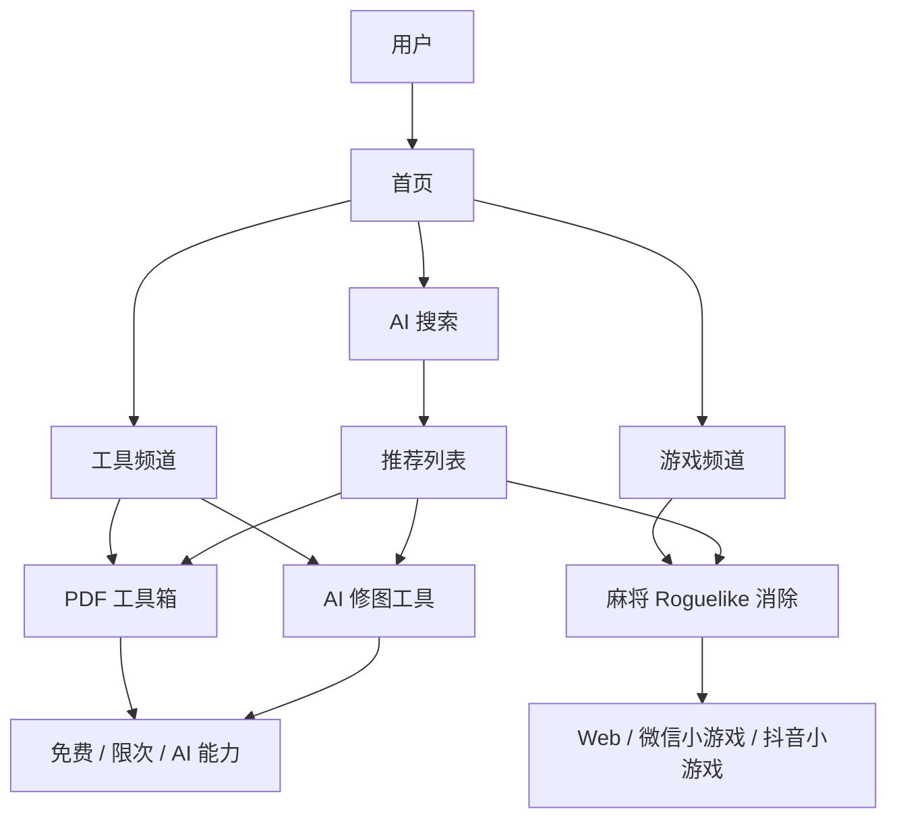

# 工具游戏门户 + AI 能力平台设计稿

**日期**：2026-05-19  
**状态**：草案  
**范围**：第一阶段 0 到 1 规划

## 1. 产品定位

第一阶段的产品定位是：

- 对外：免费工具游戏门户。
- 对内：AI 能力平台的前置流量入口。
- 第一目标：拿到搜索流量、停留时长、回访。
- 第二目标：后续把 AI 能力、订阅、自带 API、API 中转做成变现层。

工具和游戏是平级频道，不做主次叙事。AI 只做辅助搜索，返回推荐列表，不替用户直接执行。

## 2. 第一阶段交付范围

第一阶段先做两个工具和一个游戏：

1. PDF 工具箱。
2. AI 修图工具。
3. 麻将 Roguelike 消除小游戏。

这三个模块的分工：

- PDF 工具箱负责搜索刚需。
- AI 修图工具负责展示 AI 能力和未来付费空间。
- 麻将 Roguelike 消除负责停留时长和回访。

## 3. 收费原则

第一阶段采用一个简单原则：

**不调用模型能力、不产生明显高成本的功能，一律尽量免费。**

收费和限次主要用于：

- 调用 AI 模型。
- OCR 等高成本能力。
- 高清增强、批量 AI 处理等资源消耗较高的能力。
- 后续平台 AI 能力池调用。

## 4. PDF 工具箱

### 4.1 第一版免费功能

- PDF 预览。
- PDF 合并。
- PDF 拆分。
- 删除页面。
- 页面排序。
- 页面旋转。
- PDF 转图片。
- 图片转 PDF。
- PDF 转 Word。
- 添加水印。
- 添加签名。
- 基础压缩。

### 4.2 暂时不做

- 真正在线编辑 PDF 原文。
- 修改 PDF 内已有文字。
- 修改 PDF 内已有图片。

原因是完整 PDF 原文编辑的技术复杂度和商业 SDK 成本都较高，不适合作为第一阶段核心交付。

### 4.3 PDF 转 Word 边界

PDF 转 Word 第一版作为免费 Beta：

- 普通文本 PDF：尽量保留文字和基础排版。
- 扫描版 PDF：需要 OCR 时，后续再归入 AI/OCR 能力，支持免费限次或付费。

### 4.4 技术路线

- `PDF.js`：负责 PDF 预览。
- `pdf-lib`：负责合并、拆分、旋转、添加文字/图片/签名等页面级处理。
- 后续如要完整编辑 PDF 原文，再评估 Apryse、Nutrient 等商业 SDK。

## 5. AI 修图工具

### 5.1 免费功能

免费功能只做传统图像处理，不调用 AI 模型：

- 亮度。
- 对比度。
- 饱和度。
- 色温。
- 裁剪。
- 旋转。
- 缩放。
- 滤镜。
- 加边框。
- 加贴纸。
- 加文字。
- 马赛克。
- 简单去水印：裁剪、遮盖、模糊、手动涂抹。

### 5.2 收费或限次功能

这些功能需要调用 AI 模型或高成本服务：

- 根据文字要求自动修图。
- AI 美颜。
- AI 细节修复。
- AI 局部重绘。
- AI 智能去水印/智能擦除。
- AI 换背景。
- 高清增强。
- 批量 AI 处理。

### 5.3 产品文案注意

去水印功能的文案应避免鼓励侵犯版权，建议表达为：

> 去除自己图片中的遮挡、瑕疵、水印或不需要的局部元素。

### 5.4 技术路线

- 基础编辑：Canvas / WebGL。
- AI 编辑：通过统一 AI provider adapter 接入。
- 第一版先保留接口，具体模型能力可以后接。

## 6. 麻将 Roguelike 消除小游戏

### 6.1 基础玩法

- 屏幕上堆叠麻将牌。
- 玩家点击可选牌进入下方槽位。
- 满足组合后消除。
- 槽位满了失败。
- 清空牌面过关。

### 6.2 麻将组合规则

- `碰`：三张相同牌消除。
- `吃`：同花色连续三张消除，比如一万、二万、三万。
- `杠`：四张相同牌消除，并触发额外奖励。
- `清一色`：连续使用同一花色组合，叠加倍率。
- `胡牌`：关卡末尾达成指定组合，触发通关奖励。

第一阶段不做完整麻将听牌算法，不做复杂番型结算。

### 6.3 Roguelike 机制

每局是一轮 run。每过一关，从 3 个随机奖励中选择 1 个，奖励会改变本轮规则，形成不同 build。

第一批奖励示例：

- 槽位 +1。
- 第一次失败自动清一格。
- `碰` 消除后返还一步。
- `吃` 消除分数翻倍。
- `杠` 后随机清除一张牌。
- 万子牌出现率提高。
- 条子牌出现率提高。
- 筒子牌出现率提高。
- 清一色倍率上限提高。
- 每 3 次消除触发一次洗牌。
- 开局透视一层隐藏牌。
- 连续 3 次同花色消除获得额外分数。

### 6.4 第一版游戏范围

- 只做 `万 / 条 / 筒` 三类基础牌。
- 先做 20 个关卡。
- 先做 20 个 Roguelike 奖励。
- 不做多人。
- 不做排行榜。
- 不做复杂养成。
- 不做真钱激励。

### 6.5 技术路线

- 使用 `Cocos Creator`。
- 同一套逻辑发布 Web。
- 后续发布微信小游戏和抖音小游戏。
- 关卡、牌堆、目标、奖励、难度使用 JSON 配置。

## 7. 信息架构

## 8. 技术方案

### 8.1 语言

- `TypeScript` 作为主语言。
- `SQL` 用于数据库建模和查询。
- 游戏项目尽量沿用 `TypeScript`。

### 8.2 网站框架

- `Next.js`
- `App Router`
- 适合内容门户、SEO、动态路由、详情页和后台页面。

### 8.3 数据库

- `PostgreSQL`

原因：

- 适合结构化内容、热度、标签、计费、用户数据。
- 适合后续全文检索和索引优化。
- `json/jsonb` 可承载部分灵活配置。

### 8.4 ORM

- `Prisma`

原因：

- TypeScript 体验好。
- 便于建模、迁移、查询。
- 适合 0 到 1 阶段快速迭代。

### 8.5 中间件

- `Redis`

用途：

- 缓存。
- 限流。
- 会话。
- 热点数据。
- 简单任务队列预留。

### 8.6 游戏框架

- `Cocos Creator`

原因：

- 支持 Web、微信小游戏、抖音小游戏发布路径。
- 适合把 Web 小游戏和真小游戏统一到一套内容体系里。
- 游戏逻辑、关卡配置、奖励配置可以独立于门户站维护。

### 8.7 部署

- `Ubuntu 24.04 LTS`
- `Docker Compose`
- `Nginx`
- `S3` 兼容对象存储。
- CDN 可使用 Cloudflare 或同类服务。

## 9. 推荐目录结构

- `apps/web`
  - 主站。
  - 工具频道。
  - 游戏频道。
  - AI 搜索。
  - 后台管理。
- `apps/game`
  - Cocos Creator 游戏工程。
- `packages/shared`
  - 共享类型。
  - 埋点定义。
  - 权限和计费枚举。
- `docs`
  - 设计稿。
  - 实施计划。
  - 双人协作文档。
  - 当前状态文档。
  - 完成记录。

## 10. 暂时不做

- 微服务。
- Kubernetes。
- 自建模型推理平台。
- 完整支付系统。
- 完整用户中心。
- API 转售市场。
- 复杂 LLM 路由。
- PDF 原文在线编辑。
- 完整麻将算法。
- 多人游戏。

## 11. 风险和注意点

- PDF 转 Word 免费，但质量要标记为 Beta，避免过度承诺。
- 扫描版 PDF 转 Word 需要 OCR，后续应单独归入 AI/OCR 能力。
- AI 修图必须控制成本，默认不要自动调用模型。
- 去水印功能要避免侵权导向。
- 麻将 Roguelike 的复杂度要靠配置扩展，不要第一版写死复杂规则。
- 双人开发必须靠文档同步状态，避免两个人和各自 AI 修改同一片文件。

## 12. 参考

- Next.js App Router: https://nextjs.org/docs/app
- Prisma 文档: https://www.prisma.io/docs
- PostgreSQL 文档: https://www.postgresql.org/docs/
- PostgreSQL Full Text Search: https://www.postgresql.org/docs/current/textsearch.html
- Redis 文档: https://redis.io/docs/
- Cocos Creator 多平台发布: https://docs.cocos.com/creator/3.8/manual/en/editor/publish/publish-mini-game.html
- Cocos Creator 微信小游戏发布: https://docs.cocos.com/creator/2.4/manual/en/publish/publish-wechatgame.html
- Cocos Creator 字节小游戏发布: https://docs.cocos.com/creator/3.3/manual/en/editor/publish/publish-bytedance-mini-game.html

